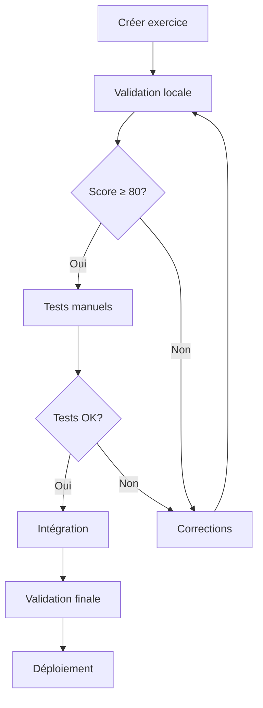

# Guide d'Intégration du Validateur - Capitaine Python

## Table des matières

1. [Installation et configuration](#installation-et-configuration)
2. [Intégration dans le workflow](#intégration-dans-le-workflow)
3. [API et endpoints](#api-et-endpoints)
4. [Scripts d'automatisation](#scripts-dautomatisation)
5. [CI/CD Integration](#cicd-integration)
6. [Monitoring et rapports](#monitoring-et-rapports)
7. [Dépannage](#dépannage)

---

## Installation et configuration

### 🔧 Prérequis

```bash
# Python 3.11+
python --version

# Dépendances requises
pip install fastapi uvicorn httpx pydantic
```

### 📁 Structure des fichiers

```
capitaine-python/
├── app/
│   ├── backend/
│   │   ├── exercise_validator.py     # Moteur de validation
│   │   ├── main.py                   # API avec endpoints de validation
│   │   ├── security.py               # Règles de sécurité
│   │   └── courses/
│   │       ├── python-basics.json    # Cours à valider
│   │       └── ...                   # Autres cours
│   └── frontend/
├── validate_integration.py           # Script de validation
├── test_validator.py                 # Tests du validateur
├── EXERCISE_PATTERNS_GUIDE.md        # Guide complet
└── SECURITY_RULES_CHEATSHEET.md      # Aide-mémoire sécurité
```

### 🚀 Démarrage rapide

```bash
# Démarrer l'API avec validation
docker-compose up --build -d

# Vérifier le validateur
curl http://localhost:8080/api/validate/stats

# Valider un exercice
python3 validate_integration.py python-basics 01-print
```

---

## Intégration dans le workflow

### 📋 Workflow de développement

#### 1. Création d'un exercice

```bash
# Étape 1 : Créer le fichier JSON
cp app/backend/courses/python-basics.json new-exercise.json

# Étape 2 : Ajouter l'exercice (respecter les patterns)
vim new-exercise.json

# Étape 3 : Valider l'exercice localement
python3 validate_integration.py
```

#### 2. Validation automatique

```bash
# Validation complète du système
python3 validate_integration.py

# Vérifier le score (> 80 requis)
# Corriger les issues détectées
# Relancer la validation
```

#### 3. Tests d'intégration

```bash
# Test du validateur
python3 test_validator.py

# Test manuel de l'exercice
curl -X POST http://localhost:8080/api/grade \
  -H "Content-Type: application/json" \
  -d '{"course_id": "python-basics", "exercise_id": "new-exercise", "code": "..."}'
```

#### 4. Intégration

```bash
# Ajouter au cours principal
cp new-exercise.json app/backend/courses/python-basics.json

# Redémarrer pour prise en compte
docker-compose restart

# Validation finale
python3 validate_integration.py
```

### 🔄 Processus de révision



---

## API et endpoints

### 🌐 Endpoints de validation

#### Validation d'exercice

```bash
POST /api/validate/exercise
Content-Type: application/json

{
  "exercise": {
    "id": "test-exercise",
    "title": {"fr": "Test"},
    "stars": 1,
    "prompt": {"fr": "Test prompt"},
    "starter": "print('test')",
    "tests": ["out = execute_code()", "assert 'test' in out"]
  },
  "strict_mode": false
}
```

**Réponse :**
```json
{
  "valid": true,
  "exercise_id": "test-exercise",
  "score": 85,
  "error_count": 0,
  "warning_count": 1,
  "info_count": 2,
  "issues": [...],
  "summary": "📊 Exercice test-exercise: 1 warning(s), 2 suggestion(s)",
  "recommendations": [...]
}
```

#### Validation de cours

```bash
POST /api/validate/course
Content-Type: application/json

{
  "course": {
    "meta": {"id": "test-course"},
    "exercises": [...]
  },
  "strict_mode": false
}
```

#### Statistiques globales

```bash
GET /api/validate/stats
```

**Réponse :**
```json
{
  "summary": {
    "total_courses": 3,
    "total_exercises": 26,
    "valid_exercises": 23,
    "overall_quality_percent": 88.5,
    "average_score": 63.3,
    "total_issues": 53,
    "error_count": 3,
    "warning_count": 50
  },
  "courses": [...],
  "health_status": {
    "status": "healthy",
    "message": "🎯 Qualité globale: 88.5% (23/26 exercices valides)"
  }
}
```

### 🔧 Intégration client

#### Python

```python
import requests

def validate_exercise(exercise_data):
    response = requests.post(
        "http://localhost:8080/api/validate/exercise",
        json={"exercise": exercise_data}
    )
    return response.json()

def check_quality_threshold(result, min_score=80):
    return result['valid'] and result['score'] >= min_score
```

#### JavaScript

```javascript
async function validateExercise(exercise) {
    const response = await fetch('/api/validate/exercise', {
        method: 'POST',
        headers: {'Content-Type': 'application/json'},
        body: JSON.stringify({exercise})
    });
    return await response.json();
}

function isValidExercise(result, minScore = 80) {
    return result.valid && result.score >= minScore;
}
```

---

## Scripts d'automatisation

### 🤖 Scripts personnalisés

#### validate_new_exercise.py

```python
#!/usr/bin/env python3
"""
Script pour valider un nouvel exercice avant intégration
"""

import json
import sys
import requests
from pathlib import Path

def validate_exercise_file(file_path):
    """Valide un fichier d'exercice JSON"""

    # Lire le fichier
    with open(file_path, 'r', encoding='utf-8') as f:
        exercise = json.load(f)

    # Validation via API
    response = requests.post(
        "http://localhost:8080/api/validate/exercise",
        json={"exercise": exercise, "strict_mode": True}
    )

    result = response.json()

    # Afficher les résultats
    print(f"🔍 Validation de {exercise.get('id', 'unknown')}")
    print(f"✅ Valide: {result['valid']}")
    print(f"⭐ Score: {result['score']}/100")

    if result['issues']:
        print("\n🚨 Issues à corriger:")
        for issue in result['issues']:
            level_icon = {'error': '❌', 'warning': '⚠️', 'info': '💡'}
            icon = level_icon.get(issue['level'], '📝')
            print(f"  {icon} {issue['message']}")
            if issue.get('suggestion'):
                print(f"     💡 {issue['suggestion']}")

    return result['valid'] and result['score'] >= 80

if __name__ == "__main__":
    if len(sys.argv) != 2:
        print("Usage: python3 validate_new_exercise.py <exercice.json>")
        sys.exit(1)

    success = validate_exercise_file(sys.argv[1])
    sys.exit(0 if success else 1)
```

#### batch_validation.py

```python
#!/usr/bin/env python3
"""
Validation en lot de plusieurs exercices
"""

import json
import requests
import glob
from concurrent.futures import ThreadPoolExecutor

def validate_exercise_data(exercise):
    """Valide un exercice et retourne le résultat"""
    try:
        response = requests.post(
            "http://localhost:8080/api/validate/exercise",
            json={"exercise": exercise}
        )
        return response.json()
    except Exception as e:
        return {"error": str(e), "exercise_id": exercise.get("id")}

def batch_validate_exercises(exercises):
    """Validation parallèle de plusieurs exercices"""
    with ThreadPoolExecutor(max_workers=5) as executor:
        results = list(executor.map(validate_exercise_data, exercises))

    # Statistiques
    valid_count = sum(1 for r in results if r.get('valid', False))
    total_count = len(results)
    avg_score = sum(r.get('score', 0) for r in results) / total_count

    print(f"📊 Validation batch: {valid_count}/{total_count} valides")
    print(f"⭐ Score moyen: {avg_score:.1f}/100")

    # Exercices problématiques
    problematic = [r for r in results if not r.get('valid', False)]
    if problematic:
        print("\n❌ Exercices à corriger:")
        for result in problematic:
            print(f"  • {result.get('exercise_id', 'unknown')}: {result.get('score', 0)}/100")

    return results

if __name__ == "__main__":
    # Exemple d'utilisation
    exercises = [
        {"id": "ex1", "title": "Ex 1", ...},
        {"id": "ex2", "title": "Ex 2", ...},
    ]

    batch_validate_exercises(exercises)
```

### 📅 Tâches planifiées

#### daily_quality_check.py

```python
#!/usr/bin/env python3
"""
Vérification quotidienne de la qualité
"""

import requests
import datetime
import json

def daily_quality_report():
    """Génère un rapport quotidien de qualité"""

    # Récupérer les statistiques
    response = requests.get("http://localhost:8080/api/validate/stats")
    stats = response.json()

    # Créer le rapport
    report = {
        "date": datetime.datetime.now().isoformat(),
        "summary": stats["summary"],
        "health": stats["health_status"]
    }

    # Sauvegarder le rapport
    report_file = f"quality_report_{datetime.date.today()}.json"
    with open(report_file, 'w') as f:
        json.dump(report, f, indent=2)

    print(f"📊 Rapport quotidien sauvegardé: {report_file}")

    # Alertes si nécessaire
    if stats["summary"]["overall_quality_percent"] < 80:
        print("⚠️ Alerte: Qualité globale < 80%")

    return report

if __name__ == "__main__":
    daily_quality_report()
```

---

## CI/CD Integration

### 🔄 GitHub Actions

#### .github/workflows/validate-exercises.yml

```yaml
name: Validate Exercises

on:
  push:
    branches: [main, develop]
  pull_request:
    branches: [main]

jobs:
  validate:
    runs-on: ubuntu-latest

    services:
      api:
        image: capitaine-python:latest
        ports:
          - 8080:8080
        options: >-
          --health-cmd "curl -f http://localhost:8080/api/health || exit 1"
          --health-interval 30s
          --health-timeout 10s
          --health-retries 3

    steps:
    - uses: actions/checkout@v3

    - name: Setup Python
      uses: actions/setup-python@v4
      with:
        python-version: '3.11'

    - name: Install dependencies
      run: |
        pip install requests

    - name: Wait for API
      run: |
        timeout 60 bash -c 'until curl -f http://localhost:8080/api/health; do sleep 2; done'

    - name: Validate all exercises
      run: |
        python3 validate_integration.py

    - name: Check quality threshold
      run: |
        python3 -c "
        import requests
        stats = requests.get('http://localhost:8080/api/validate/stats').json()
        quality = stats['summary']['overall_quality_percent']
        print(f'Qualité globale: {quality}%')
        if quality < 80:
            print('❌ Qualité insuffisante (< 80%)')
            exit(1)
        else:
            print('✅ Qualité suffisante (≥ 80%)')
        "

    - name: Upload quality report
      uses: actions/upload-artifact@v3
      with:
        name: quality-report
        path: quality_report_*.json
```

#### .github/workflows/exercise-pr.yml

```yaml
name: Exercise PR Validation

on:
  pull_request:
    types: [opened, synchronize]
    paths:
      - 'app/backend/courses/*.json'

jobs:
  validate-changes:
    runs-on: ubuntu-latest

    steps:
    - uses: actions/checkout@v3
      with:
        fetch-depth: 0

    - name: Setup Python
      uses: actions/setup-python@v4
      with:
        python-version: '3.11'

    - name: Install dependencies
      run: pip install requests

    - name: Start API
      run: |
        docker-compose up -d
        sleep 10

    - name: Validate changed exercises
      run: |
        # Identifier les fichiers modifiés
        CHANGED_FILES=$(git diff --name-only origin/main HEAD | grep '\.json$' || true)

        for file in $CHANGED_FILES; do
          echo "Validation de $file"
          python3 validate_integration.py
        done

    - name: Comment PR with results
      uses: actions/github-script@v6
      with:
        script: |
          const fs = require('fs');
          const stats = JSON.parse(fs.readFileSync('quality_report.json', 'utf8'));

          const comment = `
          ## 📊 Rapport de Validation

          - **Qualité globale**: ${stats.summary.overall_quality_percent}%
          - **Exercices valides**: ${stats.summary.valid_exercises}/${stats.summary.total_exercises}
          - **Score moyen**: ${stats.summary.average_score}/100

          ${stats.health.status === 'healthy' ? '✅' : '⚠️'} ${stats.health.message}
          `;

          github.rest.issues.createComment({
            issue_number: context.issue.number,
            owner: context.repo.owner,
            repo: context.repo.repo,
            body: comment
          });
```

### 🐳 Docker Integration

#### Dockerfile.validation

```dockerfile
FROM python:3.11-slim

WORKDIR /app

# Copier les scripts de validation
COPY validate_integration.py .
COPY test_validator.py .
COPY SECURITY_RULES_CHEATSHEET.md .

# Installer les dépendances
RUN pip install requests

# Script d'entrée
ENTRYPOINT ["python3", "validate_integration.py"]
```

#### docker-compose.validation.yml

```yaml
version: '3.8'

services:
  validator:
    build:
      context: .
      dockerfile: Dockerfile.validation
    environment:
      - API_URL=http://api:8080
    depends_on:
      - api
    volumes:
      - ./reports:/app/reports

  api:
    image: capitaine-python:latest
    ports:
      - "8080:8080"
```

---

## Monitoring et rapports

### 📊 Métriques de qualité

#### health_check.py

```python
#!/usr/bin/env python3
"""
Monitoring de la santé du système de validation
"""

import requests
import time
import json
from datetime import datetime

def monitor_quality():
    """Surveille la qualité du système en continu"""

    while True:
        try:
            # Récupérer les statistiques
            response = requests.get("http://localhost:8080/api/validate/stats", timeout=10)
            stats = response.json()

            # Extraire les métriques
            quality = stats["summary"]["overall_quality_percent"]
            score = stats["summary"]["average_score"]
            errors = stats["summary"]["error_count"]

            # Log des métriques
            timestamp = datetime.now().isoformat()
            print(f"[{timestamp}] Qualité: {quality}%, Score: {score}, Erreurs: {errors}")

            # Alertes
            if quality < 70:
                print(f"🚨 ALERTE: Qualité critique ({quality}%)")

            if errors > 0:
                print(f"⚠️ ATTENTION: {errors} erreurs détectées")

            # Sauvegarder les métriques
            metric = {
                "timestamp": timestamp,
                "quality_percent": quality,
                "average_score": score,
                "error_count": errors,
                "status": stats["health_status"]["status"]
            }

            with open("quality_metrics.jsonl", "a") as f:
                f.write(json.dumps(metric) + "\n")

        except Exception as e:
            print(f"❌ Erreur de monitoring: {e}")

        time.sleep(300)  # Vérifier toutes les 5 minutes

if __name__ == "__main__":
    monitor_quality()
```

#### quality_dashboard.py

```python
#!/usr/bin/env python3
"""
Tableau de bord de la qualité
"""

import json
import matplotlib.pyplot as plt
from datetime import datetime, timedelta

def generate_quality_dashboard():
    """Génère un tableau de bord de la qualité"""

    # Lire les métriques
    metrics = []
    with open("quality_metrics.jsonl", "r") as f:
        for line in f:
            metrics.append(json.loads(line))

    if not metrics:
        print("❌ Aucune métrique disponible")
        return

    # Préparer les données
    timestamps = [datetime.fromisoformat(m["timestamp"]) for m in metrics]
    quality = [m["quality_percent"] for m in metrics]
    scores = [m["average_score"] for m in metrics]

    # Créer le graphique
    plt.figure(figsize=(12, 8))

    # Graphique de qualité
    plt.subplot(2, 1, 1)
    plt.plot(timestamps, quality, 'b-', label='Qualité globale')
    plt.axhline(y=80, color='r', linestyle='--', label='Seuil minimum')
    plt.title('Évolution de la qualité globale')
    plt.ylabel('Qualité (%)')
    plt.legend()
    plt.grid(True)

    # Graphique des scores
    plt.subplot(2, 1, 2)
    plt.plot(timestamps, scores, 'g-', label='Score moyen')
    plt.title('Évolution des scores moyens')
    plt.ylabel('Score (/100)')
    plt.xlabel('Date')
    plt.legend()
    plt.grid(True)

    plt.tight_layout()
    plt.savefig('quality_dashboard.png')
    plt.show()

    print("📊 Tableau de bord généré: quality_dashboard.png")

if __name__ == "__main__":
    generate_quality_dashboard()
```

### 📈 Rapports automatiques

#### weekly_report.py

```python
#!/usr/bin/env python3
"""
Rapport hebdomadaire de qualité
"""

import requests
import json
import smtplib
from datetime import datetime, timedelta
from email.mime.text import MimeText
from email.mime.multipart import MimeMultipart

def generate_weekly_report():
    """Génère un rapport hebdomadaire"""

    # Récupérer les statistiques actuelles
    response = requests.get("http://localhost:8080/api/validate/stats")
    current_stats = response.json()

    # Créer le rapport
    report = f"""
# Rapport Hebdomadaire de Qualité
*Généré le {datetime.now().strftime('%Y-%m-%d %H:%M')}*

## 📊 Statistiques Actuelles
- **Cours**: {current_stats['summary']['total_courses']}
- **Exercices**: {current_stats['summary']['total_exercises']}
- **Exercices valides**: {current_stats['summary']['valid_exercises']}
- **Qualité globale**: {current_stats['summary']['overall_quality_percent']}%
- **Score moyen**: {current_stats['summary']['average_score']}/100
- **Erreurs**: {current_stats['summary']['error_count']}
- **Avertissements**: {current_stats['summary']['warning_count']}

## 🏥 État de Santé
{current_stats['health_status']['message']}

## 📋 Détails par Cours
"""

    for course in current_stats['courses']:
        status = "✅" if course['valid'] else "❌"
        report += f"""
### {status} {course['course_id']}
- Exercices: {course['exercises']}
- Validés: {course['valid_exercises']}
- Score moyen: {course['average_score']}/100
- Issues: {course['error_count']} erreurs, {course['warning_count']} avertissements
"""

    # Identifier les exercices problématiques
    problematic_courses = [c for c in current_stats['courses'] if c['error_count'] > 0]
    if problematic_courses:
        report += "\n## 🚨 Cours Requérant une Attention\n"
        for course in problematic_courses:
            report += f"- **{course['course_id']}**: {course['error_count']} erreurs\n"

    # Sauvegarder le rapport
    report_file = f"weekly_report_{datetime.date.today()}.md"
    with open(report_file, 'w') as f:
        f.write(report)

    print(f"📄 Rapport sauvegardé: {report_file}")
    return report_file

if __name__ == "__main__":
    generate_weekly_report()
```

---

## Dépannage

### 🔧 Problèmes courants

#### API ne répond pas

```bash
# Vérifier si l'API tourne
curl http://localhost:8080/api/health

# Redémarrer les services
docker-compose restart

# Vérifier les logs
docker-compose logs api
```

#### Validation échoue

```bash
# Tester avec un exercice simple
python3 -c "
import requests
exercise = {
    'id': 'test',
    'title': {'fr': 'Test'},
    'stars': 1,
    'prompt': {'fr': 'Test'},
    'starter': 'print(1)',
    'tests': ['out = execute_code()', 'assert 1 in out']
}
response = requests.post('http://localhost:8080/api/validate/exercise', json={'exercise': exercise})
print(response.json())
"
```

#### Score de validation faible

```bash
# Analyse détaillée des problèmes
python3 validate_integration.py

# Vérifier les règles de sécurité
cat SECURITY_RULES_CHEATSHEET.md

# Consulter le guide complet
cat EXERCISE_PATTERNS_GUIDE.md
```

### 📞 Support et ressources

#### Obtenir de l'aide

```bash
# Documentation du validateur
python3 -c "
from exercise_validator import ExerciseValidator
help(ExerciseValidator.validate_exercise)
"

# Exemples de validation
python3 test_validator.py

# Aide-mémoire sécurité
cat SECURITY_RULES_CHEATSHEET.md
```

#### Signaler un problème

```bash
# Créer un rapport de bug
python3 -c "
import json
import requests
from datetime import datetime

bug_report = {
    'timestamp': datetime.now().isoformat(),
    'issue': 'Description du problème',
    'steps': ['Étape 1', 'Étape 2'],
    'expected': 'Ce qui devrait arriver',
    'actual': 'Ce qui arrive réellement',
    'environment': {
        'python_version': '3.11',
        'docker': True
    }
}

with open(f'bug_report_{datetime.date.today()}.json', 'w') as f:
    json.dump(bug_report, f, indent=2)
"
```

---

## Conclusion

Ce guide d'intégration fournit tous les outils nécessaires pour intégrer efficacement le validateur d'exercices dans vos processus de développement. En suivant ces bonnes pratiques, vous assurerez une qualité constante et une sécurité optimale pour la plateforme Capitaine Python.

**Points clés à retenir :**
- 🔒 **La sécurité est non négociable**
- 📊 **La qualité se mesure objectivement**
- 🔄 **L'automatisation prévient les erreurs**
- 📈 **Le monitoring garantit l'excellence continue**

Pour toute question ou problème, consultez la documentation complète ou contactez l'équipe technique.

---

*Guide d'intégration - Version 1.0*