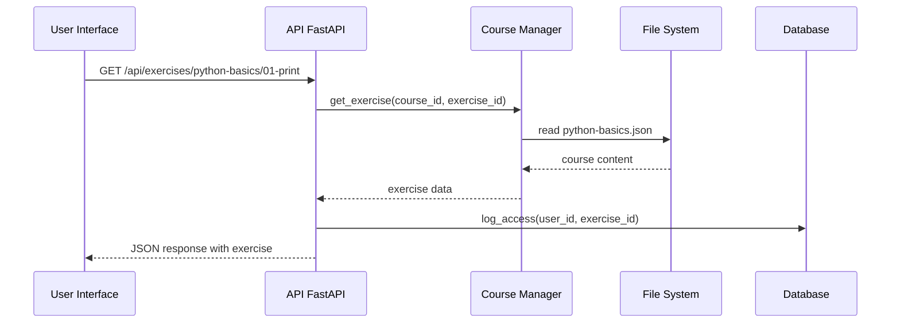
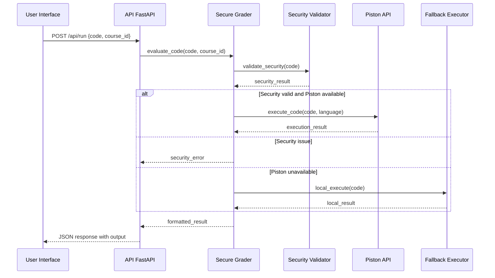
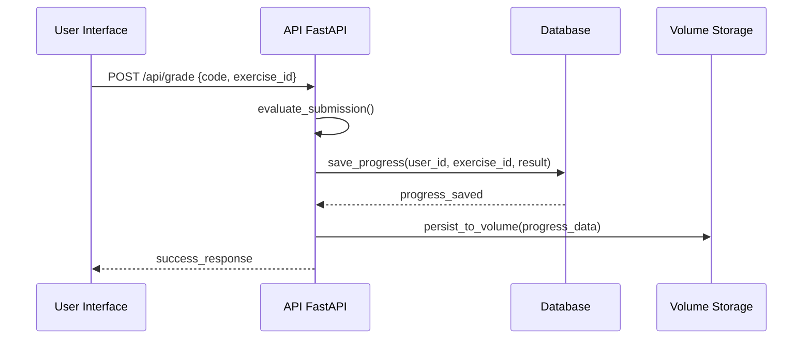

# Architecture Technique de Capitaine Python

Ce document décrit en détail l'architecture technique, les composants, les flux de données et les décisions de conception de la plateforme Capitaine Python.

## 🏗️ Vue d'Ensemble de l'Architecture

```
┌─────────────────────────────────────────────────────────────────┐
│                    CAPITAINE PYTHON                            │
├─────────────────────────────────────────────────────────────────┤
│                         Frontend                               │
│  ┌─────────────────┐  ┌─────────────────┐  ┌─────────────────┐ │
│  │   index.html    │  │     app.js      │  │    style.css    │ │
│  │   (Interface)   │  │ (Logique JS)    │  │   (Styles)      │ │
│  └─────────────────┘  └─────────────────┘  └─────────────────┘ │
└─────────────────────────────────────────────────────────────────┘
                                │
                                ▼ HTTP/REST API
┌─────────────────────────────────────────────────────────────────┐
│                      Backend FastAPI                            │
│  ┌─────────────────────────────────────────────────────────────┐ │
│  │                    main.py                                  │ │
│  │  ┌─────────────┐ ┌─────────────┐ ┌─────────────┐           │ │
│  │  │ /exercises  │ │    /run     │ │   /grade    │           │ │
│  │  │   (GET)     │ │  (POST)     │ │  (POST)     │           │ │
│  │  └─────────────┘ └─────────────┘ └─────────────┘           │ │
│  └─────────────────────────────────────────────────────────────┘ │
│                                                                 │
│  ┌─────────────────┐  ┌─────────────────┐  ┌─────────────────┐ │
│  │ course_manager  │  │ secure_grader   │  │       db        │ │
│  │                 │  │                 │  │                 │ │
│  │ • JSON loading  │  │ • Code security │  │ • SQLite        │ │
│  │ • Validation    │  │ • Piston API    │  │ • Progression   │ │
│  │ • Multilingual  │  │ • Fallback exec │  │ • Persistence   │ │
│  └─────────────────┘  └─────────────────┘  └─────────────────┘ │
└─────────────────────────────────────────────────────────────────┘
                                │
                                ▼ HTTP Requests
┌─────────────────────────────────────────────────────────────────┐
│                     Infrastructure                              │
│                                                                 │
│  ┌─────────────────┐              ┌─────────────────────────────┐ │
│  │   Piston API    │              │        Docker Network       │ │
│  │                 │              │                             │ │
│  │ • Sandboxed     │              │ • Container isolation       │ │
│  │ • Code exec     │◄─────────────┤ • Resource limits           │ │
│  │ • Timeout       │              │ • Network security          │ │
│  │ • Multi-lang    │              │                             │ │
│  └─────────────────┘              └─────────────────────────────┘ │
│                                                                 │
│  ┌─────────────────────────────────────────────────────────────┐ │
│  │                    Volume Storage                           │ │
│  │  ┌─────────────┐  ┌─────────────┐  ┌─────────────┐         │ │
│  │  │   SQLite    │  │   Courses   │  │    Logs     │         │ │
│  │  │ Database    │  │   (JSON)    │  │  (Files)    │         │ │
│  │  └─────────────┘  └─────────────┘  └─────────────┘         │ │
│  └─────────────────────────────────────────────────────────────┘ │
└─────────────────────────────────────────────────────────────────┘
```

## 🔧 Composants Techniques

### 1. Frontend (Client)

#### Technologies
- **HTML5** : Structure sémantique et accessible
- **CSS3** : Design responsive avec Flexbox/Grid
- **JavaScript Vanilla** : Logique sans framework léger
- **CodeMirror** : Éditeur de code avec coloration syntaxique

#### Architecture Frontend
```javascript
// Architecture Modulaire JavaScript
├── AppController          // Contrôleur principal
├── UIComponents           // Composants d'interface
│   ├── ExerciseSelector   // Sélecteur d'exercices
│   ├── CodeEditor         // Éditeur de code
│   ├── OutputDisplay      // Affichage des résultats
│   └── ProgressIndicator  // Barre de progression
├── APIClient              // Client HTTP pour l'API
└── StateManager           // Gestion d'état local
```

#### Caractéristiques
- **Single Page Application** : Navigation sans rechargement
- **Responsive Design** : Adaptation mobile/desktop
- **Accessible** : Support ARIA et navigation clavier
- **Progressive Enhancement** : Fonctionne sans JavaScript

### 2. Backend FastAPI (Serveur)

#### Architecture en Couches

```python
# Architecture hexagonale simplifiée
┌─────────────────────────────────────────────────────────────┐
│                    Presentation Layer                        │
│  ┌─────────────────────────────────────────────────────────┐ │
│  │                   main.py                               │ │
│  │  • FastAPI application                                   │ │
│  │  • Route definitions                                     │ │
│  │  • Request/Response models                               │ │
│  │  • Error handling                                        │ │
│  └─────────────────────────────────────────────────────────┘ │
└─────────────────────────────────────────────────────────────┘
                                │
                                ▼
┌─────────────────────────────────────────────────────────────┐
│                     Business Layer                           │
│  ┌─────────────────┐  ┌─────────────────┐  ┌───────────────┐ │
│  │ course_manager  │  │ secure_grader   │  │   Security     │ │
│  │                 │  │                 │  │   Validator    │ │
│  │ • Course logic  │  │ • Grading logic │  │ • Input safety │ │
│  │ • Content mgt   │  │ • Code exec     │  │ • Threat detect│ │
│  │ • Multilingual  │  │ • Result format │  │ • Sanitization │ │
│  └─────────────────┘  └─────────────────┘  └───────────────┘ │
└─────────────────────────────────────────────────────────────┘
                                │
                                ▼
┌─────────────────────────────────────────────────────────────┐
│                    Data Layer                               │
│  ┌─────────────────┐  ┌─────────────────┐  ┌───────────────┐ │
│  │   Database      │  │  File System    │  │ External API  │ │
│  │   (SQLite)      │  │   (JSON files)  │  │   (Piston)    │ │
│  │                 │  │                 │  │               │ │
│  │ • User progress │  │ • Course content│  │ • Code exec   │ │
│  │ • Exercise data │  │ • Metadata      │  │ • Sandboxing  │ │
│  │ • Sessions      │  │ • Configuration │  │ • Security    │ │
│  └─────────────────┘  └─────────────────┘  └───────────────┘ │
└─────────────────────────────────────────────────────────────┘
```

#### Technologies Backend
- **FastAPI** : Framework web moderne et performant
- **Uvicorn** : Serveur ASGI haute performance
- **Pydantic** : Validation et sérialisation de données
- **SQLite** : Base de données légère et embarquée
- **httpx** : Client HTTP asynchrone

#### Patterns Architecturaux

1. **Dependency Injection** : Injection via FastAPI
2. **Repository Pattern** : Abstraction des accès données
3. **Service Layer** : Logique métier séparée
4. **Factory Pattern** : Création d'évaluateurs
5. **Strategy Pattern** : Algorithmes de validation

### 3. Infrastructure

#### Docker & Containerisation

```yaml
# docker-compose.yml structure
services:
  api:           # Application FastAPI
    build: ./Dockerfile.backend
    ports: ["8080:8080"]
    volumes: ["./data:/data"]
    environment:
      - DATABASE_URL=sqlite:///data/progress.db
      - PISTON_URL=http://piston:2000

  piston:        # Service d'exécution sécurisé
    image: ghcr.io/engineer-man/piston:3.1.1
    ports: ["2000:2000"]
    volumes: ["piston_data:/data"]

networks:
  default:
    driver: bridge
    isolation: true

volumes:
  progress_data:    # Persistance DB
  piston_data:      # Cache Piston
  course_content:   # Fichiers JSON
```

#### Sécurité Multi-niveaux

```
┌─────────────────────────────────────────────────────────────┐
│                    Security Layers                          │
│                                                             │
│  1. Network Security                                        │
│     • Docker network isolation                              │
│     • Port mapping contrôlé                                 │
│     • Firewall implicite                                    │
│                                                             │
│  2. Application Security                                    │
│     • Input validation (Pydantic)                           │
│     • SQL injection prevention                              │
│     • XSS protection                                        │
│     • CORS configuration                                    │
│                                                             │
│  3. Code Execution Security                                 │
│     • Sandboxing (Piston)                                  │
│     • Timeout enforcement                                   │
│     • Resource limits                                       │
│     • Forbidden imports detection                           │
│                                                             │
│  4. Data Security                                           │
│     • File permissions                                      │
│     • Database encryption                                   │
│     • Secure logging                                        │
│     • No secrets in code                                   │
└─────────────────────────────────────────────────────────────┘
```

## 🔄 Flux de Données Détaillé

### 1. Flux : Charger un Exercice



### 2. Flux : Exécuter du Code



### 3. Flux : Sauvegarder la Progression



## 📊 Patterns de Conception

### 1. Repository Pattern

```python
# Abstraction des accès données
class ExerciseRepository:
    def get_exercise(self, course_id: str, exercise_id: str) -> Exercise:
        pass

    def save_progress(self, user_id: str, exercise_id: str, result: Result):
        pass

class SQLiteExerciseRepository(ExerciseRepository):
    def __init__(self, db_url: str):
        self.db = sqlite3.connect(db_url)

    def get_exercise(self, course_id: str, exercise_id: str) -> Exercise:
        # Implémentation SQLite
        pass
```

### 2. Factory Pattern

```python
# Création d'évaluateurs selon le type
class GraderFactory:
    @staticmethod
    def create_grader(grader_type: str) -> Grader:
        if grader_type == "secure":
            return SecureGrader()
        elif grader_type == "simple":
            return SimpleGrader()
        else:
            raise ValueError(f"Unknown grader type: {grader_type}")
```

### 3. Strategy Pattern

```python
# Différentes stratégies de validation
class SecurityStrategy:
    def validate(self, code: str) -> ValidationResult:
        pass

class StrictSecurityStrategy(SecurityStrategy):
    def validate(self, code: str) -> ValidationResult:
        # Validation stricte
        pass

class RelaxedSecurityStrategy(SecurityStrategy):
    def validate(self, code: str) -> ValidationResult:
        # Validation plus permissive
        pass
```

## 🚀 Performance et Optimisation

### 1. Performance Frontend

```javascript
// Lazy loading des exercices
class ExerciseLoader {
    async loadExercise(exerciseId) {
        if (!this.cache[exerciseId]) {
            const response = await fetch(`/api/exercises/${exerciseId}`);
            this.cache[exerciseId] = await response.json();
        }
        return this.cache[exerciseId];
    }
}

// Debouncing pour l'auto-sauvegarde
const debouncedSave = debounce((code) => {
    saveProgress(code);
}, 1000);
```

### 2. Performance Backend

```python
# Caching des cours en mémoire
@lru_cache(maxsize=128)
def get_course(course_id: str) -> Course:
    return load_course_from_file(course_id)

# Async pour les appels externes
async def execute_with_piston(code: str) -> ExecutionResult:
    async with httpx.AsyncClient() as client:
        response = await client.post(PISTON_URL, json={"code": code})
        return ExecutionResult.from_response(response)
```

### 3. Base de Données Optimisée

```sql
-- Index pour les requêtes fréquentes
CREATE INDEX idx_user_exercise ON progress(user_id, exercise_id);
CREATE INDEX idx_course_exercise ON exercises(course_id, exercise_id);

-- Transactions pour la cohérence
BEGIN TRANSACTION;
UPDATE progress SET status = 'completed' WHERE user_id = ? AND exercise_id = ?;
INSERT INTO user_stats (user_id, completed_exercises) VALUES (?, ?)
ON CONFLICT(user_id) DO UPDATE SET completed_exercises = completed_exercises + 1;
COMMIT;
```

## 🔧 Monitoring et Observabilité

### 1. Logging Structuré

```python
import structlog

logger = structlog.get_logger()

# Logging avec contexte
logger.info("exercise_completed",
           user_id=user_id,
           exercise_id=exercise_id,
           duration_ms=duration,
           success=True)

# Erreurs avec traceback
logger.error("code_execution_failed",
             user_id=user_id,
             code=code_snippet,
             error=str(error),
             exc_info=True)
```

### 2. Métriques

```python
from prometheus_client import Counter, Histogram

# Compteurs
exercise_completions = Counter('exercise_completions_total',
                              'Total completed exercises',
                              ['course_id', 'exercise_id'])

# Histogrammes
execution_duration = Histogram('code_execution_seconds',
                              'Code execution duration',
                              ['language', 'success'])
```

### 3. Health Checks

```python
@app.get("/api/health")
async def health_check():
    checks = {
        "database": await check_database(),
        "piston_api": await check_piston_api(),
        "disk_space": check_disk_space(),
        "memory_usage": check_memory_usage()
    }

    status = "healthy" if all(checks.values()) else "unhealthy"
    return {"status": status, "checks": checks}
```

## 🔒 Sécurité Approfondie

### 1. Validation en Profondeur

```python
class SecurityValidator:
    FORBIDDEN_IMPORTS = {
        'os', 'sys', 'subprocess', 'socket', 'threading',
        'multiprocessing', 'ctypes', 'importlib'
    }

    DANGEROUS_FUNCTIONS = {
        'exec', 'eval', 'compile', '__import__',
        'open', 'file', 'input', 'raw_input'
    }

    def validate_code(self, code: str) -> ValidationResult:
        # Analyse AST
        tree = ast.parse(code)

        # Vérification des imports
        for node in ast.walk(tree):
            if isinstance(node, ast.Import):
                for alias in node.names:
                    if alias.name in self.FORBIDDEN_IMPORTS:
                        return ValidationResult(False, f"Import interdit: {alias.name}")

        return ValidationResult(True, "Code sécurisé")
```

### 2. Isolation d'Exécution

```python
class SandboxedExecutor:
    def __init__(self):
        self.timeout = 5  # secondes
        self.memory_limit = 128 * 1024 * 1024  # 128MB

    async def execute(self, code: str) -> ExecutionResult:
        try:
            # Timeout avec asyncio
            result = await asyncio.wait_for(
                self._execute_with_limits(code),
                timeout=self.timeout
            )
            return result
        except asyncio.TimeoutError:
            return ExecutionResult.error("Timeout dépassé")
```

## 🚀 Évolutivité et Scalabilité

### 1. Microservices Potentiel

```
┌─────────────────┐  ┌─────────────────┐  ┌─────────────────┐
│   User Service  │  │ Course Service  │  │ Execution       │
│                 │  │                 │  │ Service         │
│ • Auth          │  • Course mgt     │  • Code exec      │
│ • Progression   │  • Content        │  • Sandboxing     │
│ • Analytics     │  • Multilingual   │  • Resource mgt   │
└─────────────────┘  └─────────────────┘  └─────────────────┘
```

### 2. Base de Données Distribuée

```yaml
# Future: PostgreSQL cluster
services:
  postgres-master:
    image: postgres:15
    environment:
      POSTGRES_REPLICATION_USER: replicator

  postgres-replica:
    image: postgres:15
    environment:
      POSTGRES_MASTER_SERVICE: postgres-master
```

### 3. Cache Distribué

```python
# Future: Redis cluster
import redis

redis_client = redis.RedisCluster(
    host="redis-cluster",
    port=7000,
    decode_responses=True
)

# Cache des résultats d'exécution
def get_cached_execution(code_hash: str) -> Optional[ExecutionResult]:
    cached = redis_client.get(f"exec:{code_hash}")
    return json.loads(cached) if cached else None
```

Cette architecture technique assure une base solide, sécurisée et évolutive pour la plateforme Capitaine Python, tout en maintenant la simplicité nécessaire pour un projet éducatif.